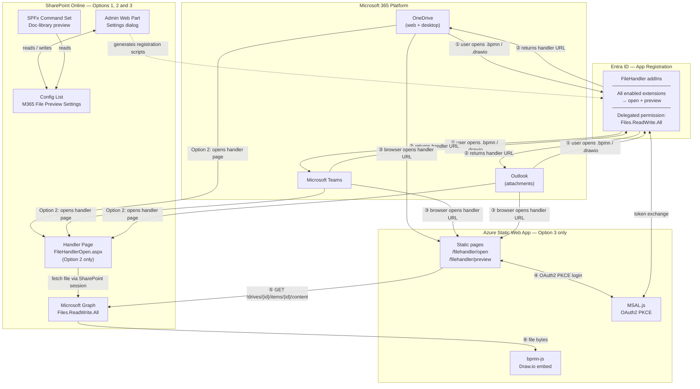

# Native File Handler — Deployment Options

## Overview

The M365 File Preview package supports three levels of capability. Each level builds on the previous one. The organization can start at any level and upgrade at any point without reinstalling the package.

---

## Option 1 — SharePoint Viewer

Files open directly inside SharePoint document libraries. Users select a file and view it without leaving SharePoint or downloading anything. Works entirely within your existing Microsoft 365 setup with no additional cost or infrastructure.

## Option 2 — Microsoft 365 Viewer

Extends the experience to OneDrive and Microsoft Teams. Users can open files from OneDrive or Teams and they open in a new browser tab showing the full viewer. Everything is hosted within your Microsoft 365 tenant — no external services or additional cost required.

## Option 3 — Full Microsoft 365 Integration

The complete native experience. Clicking a filename anywhere in Microsoft 365 — OneDrive, Teams, Outlook — shows the preview right there on screen without opening a new tab. Supports guest and external users. Requires a small Microsoft Azure deployment at minimal cost.

---

## Feature Comparison

| Feature | What it means for users | SharePoint Viewer | Microsoft 365 Viewer | Full Microsoft 365 Integration |
|---|---|:---:|:---:|:---:|
| **Open files in SharePoint** | View diagrams and models inside SharePoint without downloading | ✅ | ✅ | ✅ |
| **Click filename to open in SharePoint** | Clicking the file name opens the viewer instead of downloading | ❌ | ✅ New tab | ✅ Inline |
| **Open files from OneDrive** | Files stored in OneDrive can be opened in the viewer | ❌ | ✅ New tab | ✅ New tab |
| **Inline preview in OneDrive** | Clicking a filename in OneDrive shows the diagram right there without opening a new page | ❌ | ❌ | ✅ |
| **Open files from Microsoft Teams** | Files shared in Teams can be opened in the viewer | ❌ | ✅ New tab | ✅ New tab |
| **Inline preview in Teams** | File previews appear directly inside Teams without switching context | ❌ | ❌ | ✅ |
| **Outlook email attachments** | Diagram files attached to emails can be opened in the viewer | ❌ | ❌ | ✅ |
| **Internal users** | Everyone inside the organization can use the viewer | ✅ | ✅ | ✅ |
| **Guest / external users** | Users from outside the organization who have been shared files can open them | ❌ | ❌ | ✅ |
| **Dedicated viewer site auto-created** | A SharePoint site for the viewer is set up automatically during install | — | ✅ | — |
| **Azure deployment required** | Requires setting up a service on Microsoft Azure | ❌ | ❌ | ✅ |
| **Additional cost** | Any cost beyond the existing Microsoft 365 subscription | None | None | Minimal (free tier) |
| **Admin setup** | What the IT admin needs to do after deploying the package | Deploy package | Deploy package + click setup in admin panel | Deploy package + deploy Azure app + click setup |

---

## Technical Architecture

### Option 1 — SharePoint Viewer

The SPFx package is deployed to the SharePoint App Catalog. A command set extension adds an "Open" button to SharePoint document libraries. Clicking it opens a viewer dialog in the browser. No external services, no Azure, no additional authentication. The config list and admin settings page self-provision the first time an admin opens the settings panel.

### Option 2 — Microsoft 365 Viewer

Builds on Option 1. A new SPFx web part (file handler page) is included in the same package. During admin setup (single button click in the admin panel), a dedicated SharePoint site collection is automatically created and configured with read access for all internal users. A native Microsoft 365 File Handler is registered in Entra ID pointing to this SharePoint-hosted page, enabling OneDrive and Teams to route file opens to the viewer.

**Key constraints:**
- All enabled file types can be registered as native File Handlers. The SharePoint-hosted web part already contains all renderers including WASM-based ones (IFC, STEP), so no additional bundling is required.
- Files open in a new browser tab (not inline) because SharePoint-hosted pages cannot be embedded in iframes from external Microsoft 365 services.
- Guest and external users cannot access the SharePoint-hosted viewer page automatically. This is a platform limitation — SharePoint site access requires explicit invitation per guest account.

### Option 3 — Full Microsoft 365 Integration

Builds on Option 2. An Azure Static Web App (free tier) is deployed outside of Microsoft 365 and registered as the file handler endpoint in Entra ID, replacing the SharePoint-hosted page. The SWA uses MSAL authentication, allowing any Microsoft account (including guests) to authenticate independently. The SWA controls its own response headers, allowing Microsoft 365 services to embed the viewer inline — enabling both inline preview in OneDrive and Teams, and inline preview directly in the SharePoint document library when a filename is clicked.

**File type support:**
- `.bpmn`, `.drawio`, `.mmd`, `.mermaid` — straightforward, pure JavaScript renderers
- `.ifc`, `.step`, `.stp` — supported but require the WASM renderer files to be bundled separately into the SWA deployment (these are large binary files not automatically included in a static web app)

**Upgrade path from Option 2 to Option 3:**
1. Deploy the Azure Static Web App
2. Update the endpoint URL in the File Preview Admin settings panel
3. Rerun the registration script — the Entra ID registration updates in place
4. No reinstall of the SPFx package is required

---

## Architecture Diagram

---

## Azure Static Web App — Deployment Steps (Option 3)

| # | Step | Who | Where |
|---|---|---|---|
| 1 | Create Azure resource group | Azure Admin | Azure Portal |
| 2 | Create Azure Static Web App (Free tier) | Azure Admin | Azure Portal or CLI |
| 3 | Deploy the file handler app to the SWA | Developer / Azure Admin | GitHub Actions or `swa deploy` CLI |
| 4 | Note the SWA URL (`https://[name].azurestaticapps.net`) | Azure Admin | Azure Portal |
| 5 | Enter the SWA URL in File Preview Admin settings | SharePoint Admin | SharePoint admin settings dialog |
| 6 | Run the Native File Handler registration script | Entra Admin | Generated by admin settings dialog |
| 7 | Grant admin consent for Graph permissions | Entra Admin | Entra ID Portal → App registrations → API permissions |
| 8 | Check "Native File Handler is registered" toggle in admin panel | SharePoint Admin | SharePoint admin settings dialog |
| 9 | Verify in OneDrive — right-click a `.bpmn` or `.drawio` file | Any user | OneDrive web |
| 10 | Run cleanup script if old handlers still appear | Entra Admin | Generated by admin settings dialog |

---

## Decision Summary

| | SharePoint Viewer | Microsoft 365 Viewer | Full Microsoft 365 Integration |
|---|:---:|:---:|:---:|
| Works today, zero setup beyond package deploy | ✅ | — | — |
| No Azure required | ✅ | ✅ | ❌ |
| Works in OneDrive and Teams | ❌ | ✅ | ✅ |
| Inline preview (no new tab) | ❌ | ❌ | ✅ |
| Guest and external users | ❌ | ❌ | ✅ |
| Layers are additive — upgrade without reinstall | ✅ | ✅ | ✅ |
